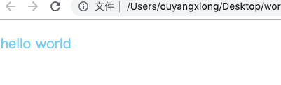
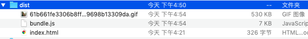
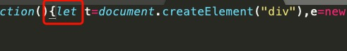
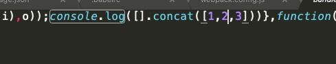
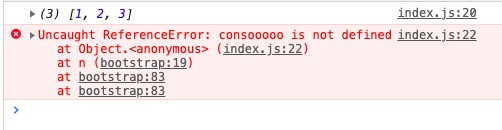
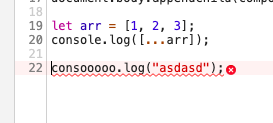
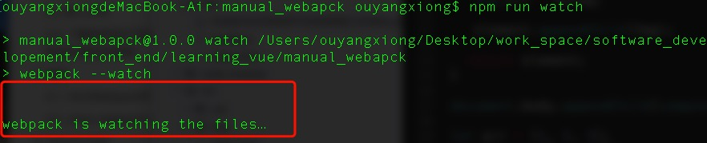
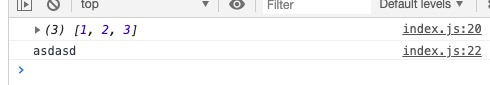

# webpack4.0 手动搭建web项目

## 1.准备工作

- 创建一个项目根目录（开发工具：sublime）

- 进入该目录，输入命令初始化目录：**npm init -y**（此时目录下出现package.json文件）

- 新建立以下的目录结构：

  /dist

  /src

  /src/index.js

- 完成基本的webpack配置

  1. 安装基本的webpack包

     **npm install -save-dev webpack webpack-cli**

  2. 进行简单的webpack配置

     在根目录下创建webpack.config.js，写入配置

     ```js
     const path = require('path')
     
     module.exports = {
     	entry: './src/index.js',
     	output: {
     		filename: 'bundle.js',
     		path: path.resolve(__dirname, 'dist')
     	}
     }
     ```

  3. 在package.json文件的scripts属性下配置npm脚本

     **"build": "webpack"**

- 运行npm命令

  在终端输入**npm run build**就可以对src目录下的index.js文件打包，在dist目录下生成bundle.js文件。

## 2. ES6的babel转码配置

- 安装babel-preset-env包

  **npm install –-save-dev babel-preset-env**

- 在根目录下创建.babelrc文件，输入一下配置

  ```json
  {
   "presets": [
   "env"
   ],
   "plugins": []
  }
  ```

  

- babel-cli进行校验配置是否成功

  安装babel-cli : **npm install --save-dev babel-cli**

- 在根目录下创建一个babel_test文件用于测试

  **--babel_test**

  **----test.js**

  ```js
  /* test.js */
  let arr = [1, 2, 3];
  console.log([...arr]);
  ```

- 在package.json添加npm脚本

  ```js
  "script":{
      ...
      "babel": "babel ./babel_test/test.js -o ./babel_test/res.js"
  }
  ```

  该脚本的作用就是将test.js进行转码，并将转码后的内容存储到res.js文件中。

- 运行

  在终端执行 **npm run babel** 则会在相同目录下生成res.js

  编译结果：

  ```js
  "use strict";
  
  var arr = [1, 2, 3];
  console.log([].concat(arr));
  ```

  该文件已经转码成功，说明我们的配置是正确的。


## 3. 安装简单的loader解析


### 3.1. 导入css

​	webpack中，有一种操作就是在“.js”文件中引入非javascript资源，所以在将其打包的过程中，我们需要某些loader解析器对相关的资源进行解析。

- 引入css资源

  1. 安装style-loader和css-loader

     **npm install --save-dev style-loader css-loader**

  2. 配置webpack.config.js

     ```js
     const path = require('path')
     
     module.exports = {
     	entry: "./src/index.js",
     	output: {
     		filename: "bundle.js",
     		path: path.resolve(__dirname, "dist"),
     		
     	},
     	resolve: {
             //extensions,在导入语句没带文件后缀时，Webpack 会自动带上后缀后去尝试访问文件是否存在
     		extensions: ['.js','.vue','.json'],
             //配置项通过别名来把原导入路径映射成一个新的导入路径
     		alias: {
     			"vue$": "vue/dist/vue.esm.js",
     			"@": "./src"
     		}
     	},
     	module:{
     		rules: [
     			{
                     //正则表达式
     				test: /\.css$/,
     				use: [
     					'style-loader',
     					'css-loader'
     				]
     			}
     		]
     	}
     }
     ```

- 创建css文件

  **--src/css/style.css**

  ```css
  .hello {
    color: skyblue;
  }
  ```

- 在入口文件index.js导入

  ```js
  import './css/style.css'
  ```

- 验证style.css是否成功被打包

  1. 在dist下创建一个index.html

     ```html
     
     <!DOCTYPE html>
     <html lang="en">
     <head>
       <meta charset="UTF-8">
       <meta name="viewport" content="width=device-width, initial-scale=1.0">
       <meta http-equiv="X-UA-Compatible" content="ie=edge">
       <title>webpack_all</title>
     </head>
     <body>
       <p class="hello">hello world</p>
       <script src="./bundle.js"></script>
     </body>
     </html>
     ```

  2. 打开index.html，查看效果

     

### 3.2 导入文件

- **npm install --save-dev file-loader**

- **webpack.config.js:**

  ```js
  module.exports = {
  	...
  	module:{
  		rules: [
              ...,
  			{
                  test: /\.(png|svg|jpg|gif)$/,
                  use: [
                    'file-loader'
                  ],
          		exclude: /node_modules/
  
  			}
  		]
  	}
  }
  ```

- 创建./src/img目录，放置入案例图片

- 在index.js中导入

  ```js
  import MyImg from './img/img1.gif'
  ```

- 利用js将image渲染到节点上

  ```js
  /* index.js */
  function component() {
    let element = document.createElement('div');
   
     // 将图像添加到我们现有的 div。
     let Img = new Image();
     Img.src = MyImg;
   
     element.appendChild(Img);
   
    return element;
  }
   
  document.body.appendChild(component());
  ```

- 打包

- 打开html

  

- 解析

  实际上，在打包的过程中我们也把该图片打包到出口目录中

  

  只不过图片的名字已经改成了随机串，同时页面中引用的图片也是打包后的这张图片。


### 3.3. 了解如何在打包的时候对代码进行相应的转码

​	之前的打包操作都是没进行es6转es5转码操作的，如图：

​	 

​	图中出现了es6的let类型，所以接下来，我要实现打包的时候对代码进行相应的转码。

- 安装babel-core,babel-loader包（由于前面已经安装了babel-preset-env，故忽略它）

  > 注意：babel-loader是依赖于babel-core的，babel的核心api主要在babel-core里。
  >
  > 若已经安装了babel-cli， 而无安装babel-core，则babel-loader能够正常使用;
  >
  > 同时还要注意版本问题，babel7对应babel-loader8，babel6对应babel-loader7

  **npm install --save-dev babel-core babel-loader**

  > babel7对应babel-loader8版本：npm install --save-dev babel-loader @babel/core @babel/preset-env

- 添加babel-loader规则

  ```js
  module.exports = {
  	...
  	module:{
  		rules: [
              ...,
  			{
                  test: /\.js$/,
                  use: [
                    'babel-loader'
                  ]
  			}
  		]
  	}
  }
  ```

- 在index.js加入以下代码，以便校验

  ```js
  let arr = [1, 2, 3];
  console.log([...arr]);
  ```

- 打包

- 查看bundle.js

  

  搜索发现已经转码成功。


## 4. 插件

### 4.1. HtmlWebpackPlugin

​	它会生成一个html文件，并将打包后的文件添加到进去，也就省去了我们手动去创建去添加，特别是我们打包的文件名可能经常会更改。

- **npm install --save-dev html-webpack-plugin**

- 在webpack.config.js中进行配置

  ```js
  ...
  const HtmlWebpackPlugin = require("html-webpack-plugin")
  
  module.exports = {
  	...
  	resolve: {
  		...
  	},
  	module:{
  		...
  	},
  	plugins: [
  		new HtmlWebpackPlugin({
  			title: "webpackTest",
  			filename: "index.html",
  			template: "./src/index.html",
  			inject: true
  		})
  	]
  }
  ```

  解释：

   	1. title：html文件中title标签的内容，在没有配置template属性时，自动生成的html文件的title标签字段就是该title属性的值。；
   	2. filename：指定生成的html文件的位置，其相对于出口目录而定；
   	3. template：属性就是指定一个html文件作为将会生成的html文件的模板；
   	4. inject：有四个值true、body、head、false
       - true:  默认值，script标签位于html文件的 body 底部
       - body:  script标签位于html文件的 body 底部
       - head: script标签位于html文件的 head中
       - false: 不插入生成的js文件 (这个几乎不会用到的)

- 测试

  创建的 **src/index.html** 作为模版：

  ```js
  <!DOCTYPE html>
  <html lang="en">
  <head>
    <meta charset="UTF-8">
    <meta name="viewport" content="width=device-width, initial-scale=1.0">
    <meta http-equiv="X-UA-Compatible" content="ie=edge">
    <title>webpack_all</title>
  </head>
  <body>
    <p class="hello">hello world</p>
    
  </body>
  </html>
  ```

  

  打包查看，结果可以看到dist目录下生成了一个新的index.html覆盖了之前的index.html：

  ```html
  <!DOCTYPE html>
  <html lang="en">
  <head>
    <meta charset="UTF-8">
    <meta name="viewport" content="width=device-width, initial-scale=1.0">
    <meta http-equiv="X-UA-Compatible" content="ie=edge">
    <title>new_webpack_test</title>
  </head>
  <body>
    <p class="hello">hello world</p>
    
  <script type="text/javascript" src="bundle.js"></script></body>
  </html>
  ```

- 问题

  我们会发现，用file-loader引入的一张图片，并会在出口目录下会生成一张以图片内容的MD5哈希值命名的图片，但是我们的img标签引用的是 **./img/img1.gif**，这个时候我们想呈现这张图片时就需要手动更改标签中src属性中图片的名字，能不能有办法让它自动更改呢？

- 解决

  1. 安装**html-withimg-loader**：

     **npm install --save-dev html-withimg-loader**

  2. 在webpack.config.js添加如下配置：

     ```js
     relus:[
         ...
         {
             test: /\.html$/,
             loader: 'html-withimg-loader'
         }
     ]
     ```

  3. 重新打包，结果略


### 4.2. clean-webpack-plugin

​	**通常，在每次构建前清理 /dist 文件夹，是比较推荐的做法，因此只会生成用到的文件。让我们完成这个需求。**

​	假如之前打包，在dist目录下生成了一个hello.js文件，但是后来我们又再打包生成的文件中没有这个文件，也不需要要用到这个文件，那此时dist中这个文件就是多余的，我们根本不会用到，所以我们需要通过某些手段在打包之前将dist目录清空。这里，我们用到了clean-webpack-plugin。

- 安装插件

  **npm install --save-dev clean-webpack-plugin**

- 在webpack.config.js文件中进行配置

  ```js
  const CleanWebpackPlugin = require('clean-webpack-plugin');
  ...
  module.exports = {
      ...
      plugins:[
          ...
          new CleanWebpackPlugin()
      ]
  }
  ```


###4.3. uglifyjs-webpack-plugin

​	uglifyJsPlugin 用来对js文件进行压缩，从而减小js文件的大小，加速load速度。

- 安装插件

  **npm install uglifyjs-webpack-plugin --save-dev**

- 在webpack.config.js文件中进行配置

  ```js
  	...
  	plugins: [
  		...
  		new UglifyJsPlugin()
  	]
  ```


## 5. Source map

​	简单说，Source map就是一个信息文件，里面储存着位置信息。也就是说，转换后的代码的每一个位置，所对应的转换前的位置。有了它，出错的时候，除错工具将直接显示原始代码，而不是转换后的代码。这无疑给开发者带来了很大方便。

- 在webpack.config.js中添加devtool选项

  ```js
  module.exports = {
      ...
      devtool: 'inline-source-map',
  }
  ```

- 测试

  在入口文件index.js写个报错语句。

- 打包查看报错信息，我们能清晰得知代码报错的位置






## 6.开发手段

​	之前，我们想要查看代码结果，每次要编译代码时，手动运行npm run build特别麻烦。

webpack中有几个不同的选项，可以帮助你在代码发生变化后自动编译代码：

### 6.1. 观察模式

- **webpack's Watch Mode(观察模式)**

1. 说明

   如果我们的源代码中，一个文件被更改了，代码将被重新编译，所以我们不必手动地去重新打包。

2. 在package.json中添加一个npm script脚本

   ```json
   "script": {
     	...,
     	"watch": "webpack –watch",
     	...
   }
   ```

3. 启动观察者模式

   在命令行做运行**npm run watch**，此时script脚本一直在监听文件

   

4. 打开index.html

   打开之前创建的index.html查看上一单元Source map 留下的那段错误代码：

   

5. 改正，保存，刷新index.html，发现已经自动编译好了

   


### 6.2.开发者服务器模式

- **webpack-dev-server**

1. 说明

   ​	观察模式虽然能够达到自动编译代码的效果，但是其有一个缺点，就是只能帮我们自动重新编译，但不会帮我们重新刷新浏览器。如果想要在重新编译代码的同时刷新浏览器，则可以尝试使用webpack-dev-server。

   ​	webpack-dev-server提供一个简单的web服务器，并且能够实时重新加载(living reloading)。

2. 安装相应的包

   **npm install –save-dev webpack-dev-server**

3. 在webpack.config.js中配置：

   ```js
   module.exports = {
     	...,
     	devServer: {
       	//将dist目录下的文件，作为可访问文件
       	contentBase: './dist'
     	},
     	...
   }
   ```

4. 在package.json文件中添加script脚本

   ```json
   
   "script": {
     	...,
     	"start": "webpack-dev-server --open",
     	...
   }
   ```

5. 运行

   **npm run start** 

   此时会发现，服务器自动打开，且url为localhost:8080，现在修改和保存任意源文件，web服务器就会自动重新加载编译后的代码。


## 7.生成环境构建

​	官方介绍：

​	*development(开发环境)* 和 *production(生产环境)* 这两个环境下的构建目标存在着巨大差异。在*开发环境*中，我们需要：强大的 source map 和一个有着 live reloading(实时重新加载) 或 hot module replacement(热模块替换) 能力的 localhost server。而*生产环境*目标则转移至其他方面，关注点在于压缩 bundle、更轻量的 source map、资源优化等，通过这些优化方式改善加载时间。由于要遵循逻辑分离，我们通常建议为每个环境编写**彼此独立的 webpack 配置**。

虽然，以上我们将*生产环境*和*开发环境*做了略微区分，但是，请注意，我们还是会遵循不重复原则(Don't repeat yourself - DRY)，保留一个 "common(通用)" 配置。为了将这些配置合并在一起，我们将使用一个名为 [`webpack-merge`](https://github.com/survivejs/webpack-merge) 的工具。此工具会引用 "common" 配置，因此我们不必再在环境特定(environment-specific)的配置中编写重复代码。

### 7.1 配置

- 安装webpack-merge

  **npm install --save-dev webpack-merge**

- 添加以下几个配置文件

  **--webpack.common.js**

  **--webpack.dev.js**

  **--webpack.prod.js**

- 分解之前写的webpack.config.js

  1. webpack.common.js:

     ```js
     const path = require('path');
     const CleanWebpackPlugin = require('clean-webpack-plugin');
     const HtmlWebpackPlugin = require('html-webpack-plugin');
     
     
     module.exports = {
     	entry:{
     		app: './src/index.js'
     	},
     	output:{
     	    filename: '[name].bundle.js',
     	    path: path.resolve(__dirname, 'dist')
     	},
     	resolve: {
     
     		//在导入语句没带文件后缀时，Webpack 会自动带上后缀后去尝试访问文件是否存在
     		extensions: ['.js','.vue','.json'],
     
     		//配置项通过别名来把原导入路径映射成一个新的导入路径
     		alias: {								
     			"vue$": "vue/dist/vue.esm.js",
     			"@": "./src"
     		}
     	},
     	module:{
     		rules: [
     			{
     				test: /\.css$/,
     				use: [
     					'style-loader',
     					'css-loader'
     				]
     			},
     			{
     				test: /\.(gif|png|jpg|svg)$/,
     				use: [
     					"file-loader"
     				]
     			},
     			{
     				test: /\.js$/,
     				use: [
     					"babel-loader"
     				],
     				exclude: /node_modules/
     			},
     			{
     				test: /\.html$/,
     				loader: 'html-withimg-loader'
     			}
     		]
     	},
     	plugins: [
     		new CleanWebpackPlugin(),
     		new HtmlWebpackPlugin({
     			title: 'Production'
     		})
     	]
     
     }
     ```

  2. webpack.dev.js

     ```js
     const merge = require('webpack-merge');
     const common = require('./webpack.common.js');
     
     module.exports = merge(common, {
       	
       	devtool: 'inline-source-map',
       	devServer: {
         	contentBase: './dist'
       	}
      
     }
     ```

  3. webpack.prod.js

     ```js
     const merge = require('webpack-merge');
     const UglifyJsPlugin = require('uglifyjs-webpack-plugin');
     const common = require('./webpack.common.js');
     
     module.exports = merge(common, {
     	plugins: [
     		new UglifyJsPlugin()
     	]
     })
     ```

- 修改package.json命令

  ```json
  {    
      ...
   	// "build": "webpack",		 除去
      // "start": "webpack-dev-server --open",	除去
  	"dev": "webpack-dev-server --open --config webpack.dev.js",
      "build": "webpack --config webpack.prod.js",
   	...   
  }
  ```

-  说明

  之后我们开发时，就可以通过命令**npm run dev** 进入开发环境，**npm run build **则将项目以生产环境进行打包。

